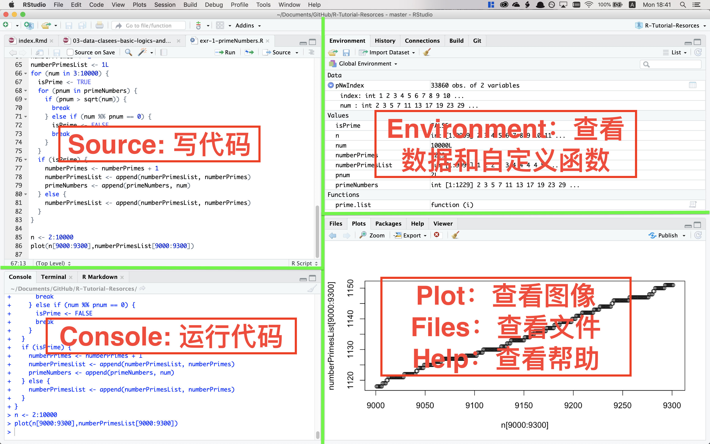

# RStudio界面介绍，基本操作，和创建新项目 {#ch2}

## 界面

### 概览

```{r echo=FALSE}

```

### 左下角：Console（控制台）

Console是执行代码的地方。试试在里面输入`1 + 1`并按回车以执行。

### 左上角：Source（源）

Source是写代码的地方。请看第\@ref(manage)节。

这个位置也是用来查看文件和数据的地方。试试在console中执行`View(airquality)`或`library(help = "stats")`.

### 右上角：Environment（环境），

Environment 是一个列表，显示了所有当前工作环境中所有的变量（“values”和“data”）和自定义的函数（functions）。

History（历史）和 Connections（连接）不太常使用。

### 右下角：Plots（绘图），Help（帮助），Files（文件）和Packages（包）

Plots是预览图像的区域。试试在console中执行`hist(rnorm(10000))`.

Help是查看帮助文件的区域。试试在console中执行`?hist`或`?norm`.

Files是查看文件的区域，默认显示工作目录 (working directory)。

Packages是安装/查看/更新packages（包）的区域。详情请看第\@ref(packages)章。

## 基本操作

### 执行代码

试着在console里输入`1 + 1`，并按回车以执行。你的console会显示：

```{}
> 1 + 1
[1] 2
```

其中`2`是计算结果， `[1]`是索引，在第\@ref(indexing)节有解释。`> 1 + 1`是input，`[1] 2`是output.

还是用`1 + 1`举例，在本书中，对于input和output的展示格式是这样的：

```{r}
1+1
```

注意input中的`>`被省略了，这意味着你可以直接把代码从本书复制到你的console并按回车执行（因为console本身自带了`>`)，类似地，你从其他各种网站上找到的说明书，教程和论坛帖子中看到的R代码，大多数也都是这种形式呈现，便于复制粘贴。

再来一个例子，试着在console里输入（或者复制）以下代码并执行：

```{r}
attach(airquality)
plot(Wind, Ozone, main = "Ozone and Wind in New York City", pch = 20)
model <- lm(Ozone ~ Wind, airquality)
abline(model, lwd = 2)
```

可以看到，在plots区，生成了一副漂亮的图。（先别在意每行代码具体的作用，在之后的章节我会一一讲述）

这时，把RStudio关掉，再重新启动，你会发现你的图没了。因此我们需要记录和管理代码。

### 记录和管理代码 {#manage}

初学者经常会在console里写代码，或者从别处复制代码，并执行。这对于一次性的计算（比如写统计学作业时用R来算线性回归的参数）很方便，但是如果你想保存你的工作，你需要把它们记录在R script文件里。如果你的工作比较复杂，比如有一个excel表格作为数据源，然后在R中用不同的方法分析，导出图表，这时候你会希望这些文件都集中在一起。你可以使用R Project来管理它们。

#### 创建R Project

1. 左上角File > New Project
2. 点选New Directory > New Project 
3. 输入名称和目录并Create Project

#### 使用R Project

在创建R project的文件夹中打开`.Rproj`文件。或者，RStudio启动的时候默认会使用上一次所使用的R project. 

随后，你在RStudio中做的所有工作都会被保存到`.Rproj`所在的这个文件夹（正规的说法是“工作目录” (working directory)）。比如，在console中执行：

```{r eval=FALSE}
pdf("normalDistrubution.pdf")
curve(dnorm(x),-5,5)
dev.off()
```

一个正态分布的图像便以pdf格式保存在了工作目录。你可以在系统的文件管理器中，或是在RStudio右下角File面板中找到。

### 写/保存/运行R script

在console中运行代码，代码得不到保存。代码需保存在R script文件（后缀为`.R`）里。

`Ctrl`+`Shift`+`N`（Mac是`command`+`shift`+`N`）以创建新R script. 

然后就可以写R script. 合理使用换行可以使你的代码更易读。`#`是注释符号。每行第一个`#`以及之后的内容不会被执行。之前的例子，可以写成这样：

```{r eval=FALSE}
# 读取数据
attach(airquality)

# 绘图
plot(Wind, Ozone, # x轴和y轴
     main = "Ozone and Wind in New York City", # 标题
     pch = 20) # 使用实心圆点
model <- lm(Ozone ~ Wind, airquality) # 线性回归模型
abline(model, lwd = 2) # 回归线
```

`Ctrl`+`Enter` (`command`+`return`)以执行一“句”代码（比如上面的例子中，从`plot(Wind...`到`pch = 20)`有三行，但是它是一“句”）。

`Ctrl`+`Shift`+`Enter` (`command`+`shift`+`return`)以从头到尾执行所有代码。

试试复制并执行以上代码吧。

`Ctrl`+`S` (`command`+`S`)以保存R script. 保存后会在工作目录找到你新保存的`.R`文件。重新启动RStudio的时候，便可以打开对应的R script文件以重复/继续之前的工作。

### 关于换行

Console 中每个命令开头的`>`叫做prompt（命令提示符），当它出现在你所编辑的那一行的开头时，按下回车的时候那行的命令才会被执行。有时候它会消失，这时候按`esc`可以将其恢复。

prompt消失的主要原因是你的代码没有写完，比如括号不完整：

```{}
> 2+(3+4
```

这时你按回车，它会显示：

```{}
> 2+(3+4
+
```

`+`号是在提示代码没写完整。这时你把括号补上再按回车：

```{}
> 2+(3+4
+ )
```

```{}
[1] 9
```

便可以完成计算。

这意味着我们可以把一条很长的命令分成很多行。比如我们可以写这样的代码（在R script编辑器中！）

```{r eval=FALSE}
if(TRUE){
  print(2)
} else{
  print(3)
}
```

然后`Ctrl`+`Enter`执行。你会发现在console中，从第二行开始每行开头都有一个`+`号。
