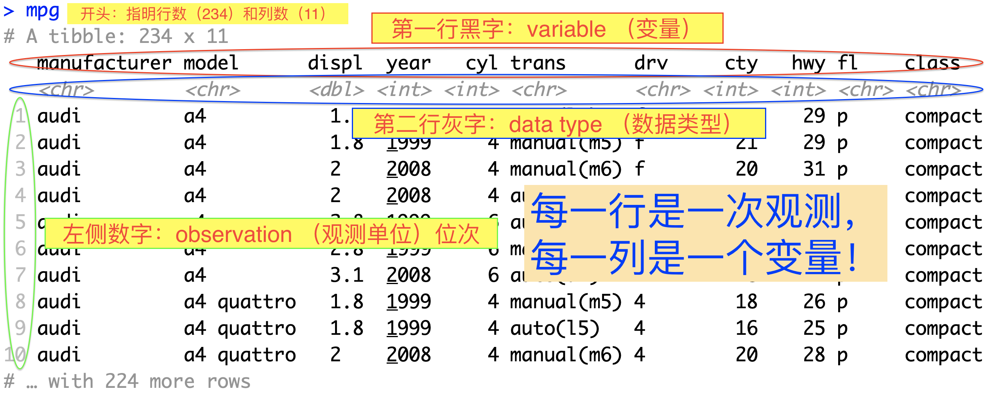

# dataframe（数据框）和tibble {#ch5}

## 基础

dataframe是R中存储复杂数据的格式，它直观易操作。tibble是tidyverse的一部分，它是dataframe的进化版，功能更强大，更易操作。

在dataframe/tibble中，每一行代表的是一个observation（硬翻译的话是“观测单位”，但是我觉得这个翻译不好），每一列代表的是一个variable（变量）。举个例子：

我们先加载tidyverse：

```{r eval=FALSE}
require(tidyverse)
```

以后每次跟着本书使用R的时候，都要先加载tidyverse，不再重复提醒了。

tidyverse中自带一些范例数据，比如我们输入：

```{r eval=FALSE}
mpg
```

```{r echo=FALSE}

```

##


## 进阶内容

这一节为进阶内容，不用看。可以直接跳到\@\ref{}

其中的很多操作和dataframe或tibble中的操作是等效的。一般，tibble中的操作更直观，更容易上手。

### arrays（数组）和matrices（矩阵）简介

Vector是一维的数据。Array是多维的数据。Matrix是二维的数据，因此matrix是array的一种特殊情况。

Dataframe不是matrix. A matrix is a two-dimensional **array** containing numbers. A dataframe is a two-dimensional **list** containing (potentially a mix of) numbers, text or logical variables in different columns.

我们可以用`dim()`来创建arrays：

```{r}
A <- 1:48 #创建一个(1,2,3,...24)的numeric vector
dim(A) <- c(6,8) #给A assign一个6乘4的dimensions
A
```

可以看到我们创建了一个二维的，array, 因此它也是一个（4行6列的）matrix。

```{r}
is.array(A)
is.matrix(A)
```

注意24个数字排列的方式。第一个维度是行，所以先把4行排满，随后再使用下一个维度（列），使用第2列继续排4行，就像数字一样，（十进制中）先把个位从零数到9，再使用第二个位数（十位），以此类推。下面三维和四维的例子可能会更清晰。

同时注意最左边和最上边的[1,], [,3]之类的标记。你应该猜出来了，这些是index. 假设你要抓取第五行第三列的数值：

```{r}
A[5,3]
```

或者第三行的全部数值：

```{r}
A[3,]
```

或者第四列的全部数值：

```{r}
A[,4]
```

接下来我们再看一个三维的例子（还是用1-48）：

```{r}
dim(A) <- c(2,8,3)
A
```

它生成了三个二维的矩阵。在每个2*8的矩阵存储满16个元素后，第三个维度就要加一了。每个矩阵开头的`, , x`正是第三个维度的值。同理，我们可以生成四维的array：

```{r}
dim(A) <- c(3,4,2,2)
A
```

观察每个矩阵开头的`, , x, y`. x是第三个维度，y是第四个维度。每个二位矩阵存满后，第三个维度（x）加一。x达到上限后，第四个维度（y）再加一。

类似二维矩阵，你可以通过index任意抓取数据，比如：

```{r}
A[ ,3 , , ] #每个矩第3每列的数据，即所有第二个维度为3的数值
```

### 给matrices和arrays命名

假设我们记录了3种药物（chloroquine, artemisinin, doxycycline)
对5种疟原虫(P. falciparum, P. malariae, P. ovale, P. vivax, P. knowlesi)的疗效，其中每个药物对每种疟原虫做6次实验。为了记录数据，我们可以做3个6*5的矩阵：（这里只是举例子，用的是随机生成的数字）

```{r}
B <- runif(90, 0, 1) #从均匀分布中取100个0到1之间的数
dim(B) <- c(6, 5, 3) #注意顺序
B
```

然后我们用`dimnames()`来命名：

```{r}
dimnames(B) <- list(paste("trial.", 1:6), c('P. falciparum', 'P. malariae', 'P. ovale', 'P. vivax', 'P. knowlesi'), c('chloroquine', 'artemisinin', 'doxycycline'))
B
```

**清清楚楚，一目了然。**

### `apply`

```{r}
apply(A,1,sum)
```